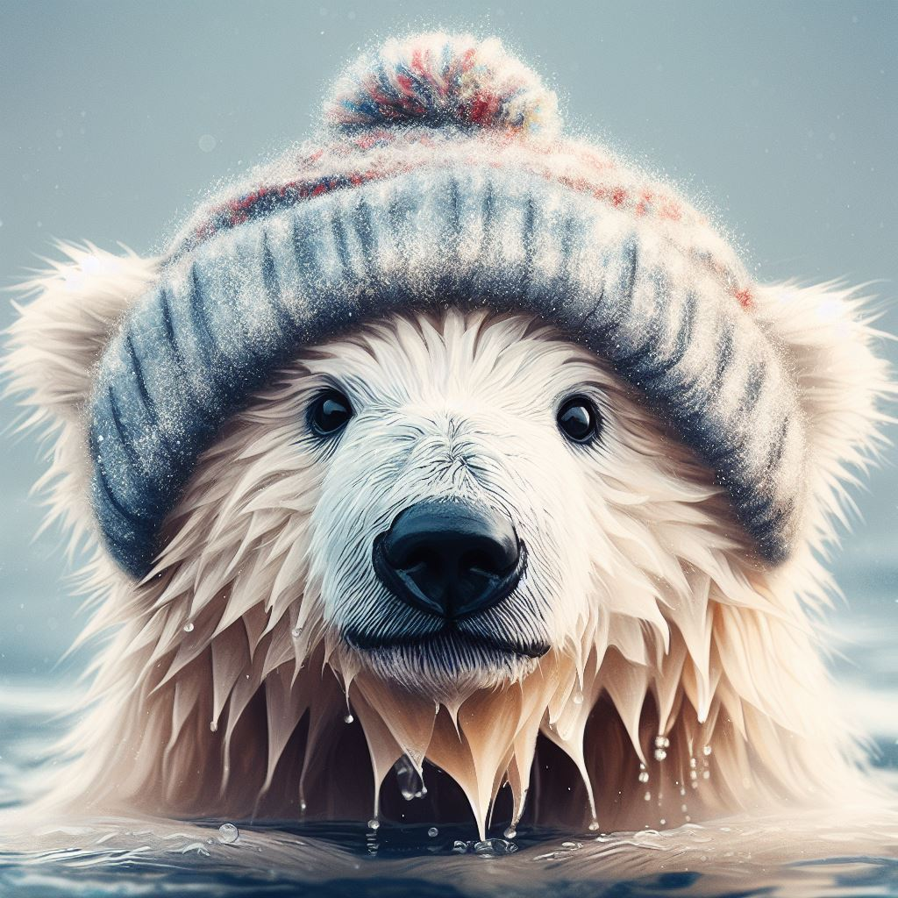
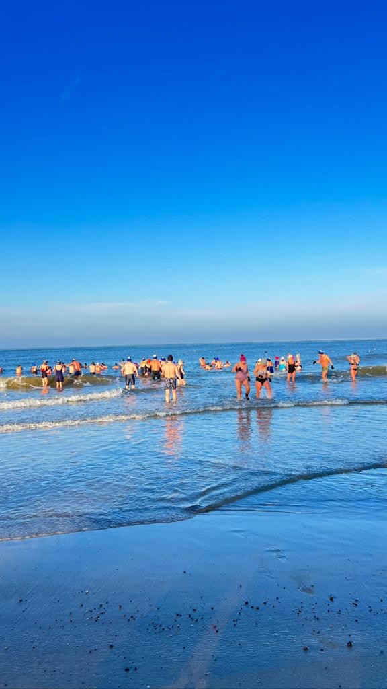
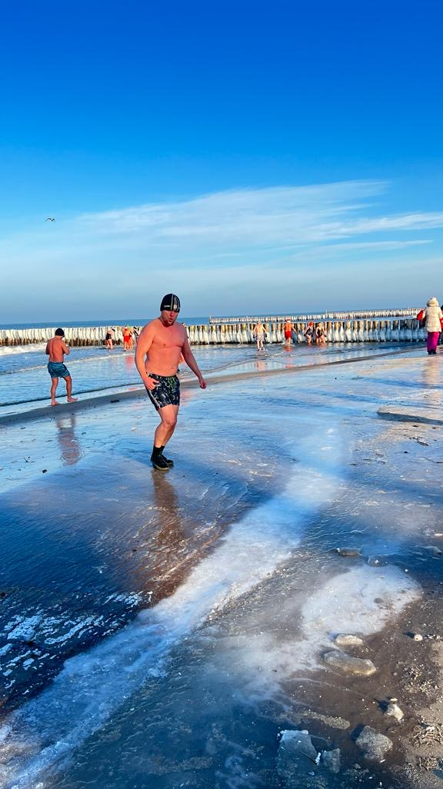
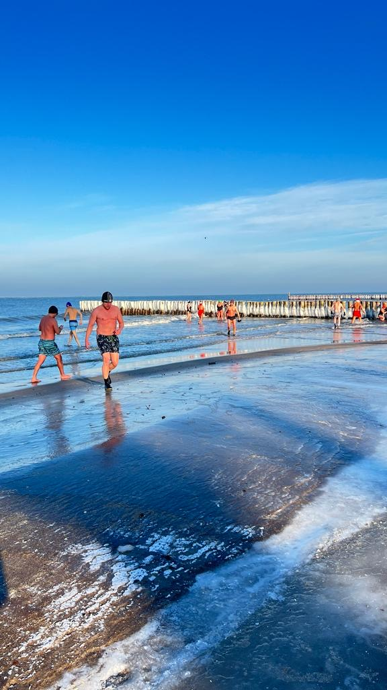

# This is my page
This is my page that demonstrates Markdown features on polar bear plunge considerations.

 *Source: Image generated using AI-based Bing Co-pilot*  

**POLAR BEAR PLUNGE - BENEFITS & RISKS OF WINTER BATHING**

- [This is my page](#this-is-my-page)
  - [Introduction](#introduction)
  - [Backgroung](#backgroung)
  - [Benefits](#benefits)
  - [Risks](#risks)

## Introduction
A polar bear plunge is an activity where people immerse themselves in very cold water, usually in the winter, for fun or charity. Some people believe that this practice has health benefits, such as boosting the immune system and improving cardiovascular health. However, there is no solid evidence to support these claims, and doctors warn that polar bear plunges can be dangerous for people with underlying health issues.

## Backgroung
The Polar Bear Plunge, also known as a polar bear swim or ice swimming, is a cold-weather winter event where participants enter a body of water despite the low temperature. 

In the United States, the first documented Polar Bear Plunge took place on New Year's Day in 1904 in Boston, Massachusetts. It was organized by a swim club called the L Street Brownies. These events are usually held to raise money for a charitable organization.

In , "Polar Bear Swims", "plunges", or "dips" are a New Year's Day tradition in numerous communities across the country. The tradition started in Vancouver in 1920 by a group of swimmers who called themselves the Polar Bear Club. Vancouver's annual Polar Bear Swim Club has been active since 1920 and typically has 1,000 to 2,000 registered participants.

In other parts of the world, similar events take place. For example, in the Netherlands, every New Year's Day around 10,000 people dive collectively into the icy cold sea water at Scheveningen, a Dutch beach resort town, since 1960. In New Zealand, polar plunges are held at various beaches, usually on the weekend closest to the shortest day in late June. In the UK, the majority of winter swimming events take place on Christmas Day or Boxing Day.

These events are not only thrilling but also have both mental and physical benefits. Some studies confirm that even taking a cold shower can elevate blood levels of the body's own mood-regulating- and painkilling hormones.

## Benefits

Cold water immersion may have some several potential benefits:

1. **Empowers the immune system**: Regular exposure to cold water can stimulate the immune system, making you less susceptible to common illnesses.
   
2. **Strengthens the heart**: Cold water immersion can improve cardiovascular health by increasing blood circulation.
   
3. **Boosts metabolism**: The body burns more calories to maintain its core temperature in cold water, potentially aiding weight loss.
   
4. **Reduces pain and helps with migraine and rheumatism**: Cold water can numb nerve endings, providing temporary relief from pain. It can also help manage symptoms of conditions like rheumatism.
   
5. **Improves skin health and tone**: Cold water can tighten the skin and improve its tone, giving a youthful appearance.
   
6. **Increases energy levels**: Cold water immersion can increase the secretion of norepinephrine, a hormone that regulates attention, focus, and energy.
   
7. Increases the libido: Some people report an increase in libido after regular cold water immersion.
   
8. **Improves mental well-being**: The shock experience from the cold water may affect hormones that are important for our mental well-being. The feeling of mastery from overcoming the initial shock of the cold can also improve quality of life and help prevent depression.

Please note that while these benefits are supported by some research, individual experiences may vary. It's also important to remember that people with certain health conditions, such as untreated cardiovascular disease or epilepsy, should avoid winter swimming. Always consult with a healthcare professional before starting any new health regimen.

## Risks
Winter bathing, particularly in cold water, can have several risks:

1. **Cardiovascular Risks**: Cold water causes blood vessels to contract, raising blood pressure and increasing the risk of a heart attack or stroke. People with untreated cardiovascular disease should avoid winter swimming.

2. **Non-Freezing Cold Injury**: This is a little-known problem associated with cold water immersion.

3. **Epileptic Seizures and Fainting**: If you have epileptic seizures or a tendency to faint, you shouldn’t attempt polar swims.

4. **Medication Interactions**: Some drugs, like beta-blockers, can make cold water swimming quite uncomfortable and cause so-called “dead fingers”.

5. **Hypothermia**: Prolonged exposure to cold water can lead to hypothermia, a dangerous drop in body temperature.

6. **Drowning Risk**: The shock of the cold can cause involuntary gasping and hyperventilation, increasing the risk of drowning.

Remember, it's important to never swim alone in ice-cold water. If you're new to winter bathing, it's recommended to start gradually and always have someone with you for safety. It's also crucial to listen to your body and get out if you start to feel uncomfortable or unwell.

Having said that, I have to say, polar bear plunges played out for me just fine. Please find below some of the pictures from my personal album. 

   
*Source: Personal Album*
 
   
*Source: Personal Album*

  
*Source: Personal Album*

*Source*: Conversation with Bing, 11/20/2023  
1) Warning! Cold water baths in winter can be fatal; can cause stroke https://www.timesnownews.com/health/warning-cold-water-baths-in-winter-can-be-fatal-can-cause-stroke-heart-attack-article-95593051.
2) Is cold water swimming in the winter healthy? - Sciencenorway. https://sciencenorway.no/cardiology-mental-health/is-cold-water-swimming-in-the-winter-healthy/1817717.
3) Cold water therapy: what are the benefits and dangers of ice baths. https://theconversation.com/cold-water-therapy-what-are-the-benefits-and-dangers-of-ice-baths-wild-swimming-and-freezing-showers-203452.
4) Getty Images. https://www.gettyimages.com/detail/news-photo/swimmer-climbs-from-a-snow-covered-jetty-into-the-ice-cold-news-photo/890896406.
5) Winter bathing - What The Denmark. https://www.whatthedenmark.com/blog-post/winter-bathing.
6) Is cold water swimming in the winter healthy? - Sciencenorway. https://sciencenorway.no/cardiology-mental-health/is-cold-water-swimming-in-the-winter-healthy/1817717.
7) 11 Benefits of Ice Baths and Cold Plunging - Michael Kummer. https://michaelkummer.com/health/ice-bath-benefits/.
8) Cold Water Therapy: Benefits of Cold Showers, Baths - Healthline. https://www.healthline.com/health/cold-water-therapy.
9) en.wikipedia.org. https://en.wikipedia.org/wiki/Ice_bath.
Source: Conversation with Bing, 11/20/2023
10) Polar bear plunge - Wikipedia. https://en.wikipedia.org/wiki/Polar_bear_plunge.
11) POLAR BEAR PLUNGE DAY - January 1, 2024 - National Today. https://nationaltoday.com/polar-bear-plunge-day/.
12) The Polar Bear Plunge: What Is It and How To Do It - Funboy. https://www.funboy.com/blogs/funboy-life/polar-bear-plunge.
13) Who started the Polar Bear dip every Jan. 1, anyway? | CBC. https://www.cbc.ca/archives/who-started-the-polar-bear-dip-every-jan-1-anyway-1.5390585.
14) en.wikipedia.org. https://en.wikipedia.org/wiki/Polar_bear_plunge.